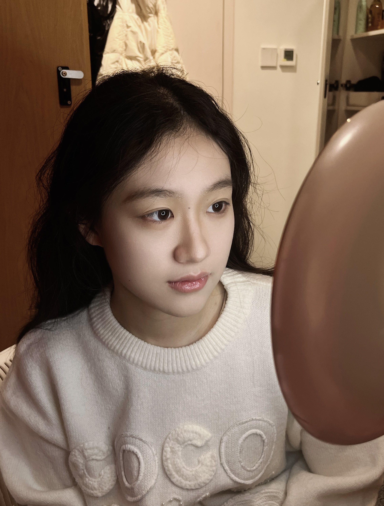

# Welcome! This is Xueting Li's personal website.
  
Nice to meet you! :) My name is Xueting Li. I'm from China and now studying in the US as a first-year graduate student at Columbia Univercity Irving Medical Center. I major in Biostatistics with Public Health Data Science track. You can find information about my academic and professional journey, as well as links to my projects and professional networks in this website.

  

# Keywords about Me

### Academic  

I'm focused on tackling mathematical challenges, particularly those involving probability, statistics, and algorithm design.  

+ **Innovative Solutions to Nonlinear Partial Differential Problems**  
As a project leader in Kunshan, China, I simulated 10,000 paths using the Feynman-Kac driving equation, establishing boundary conditions. I derived functions to solve nonlinear equations based on American option pricing techniques and employed Monte Carlo simulations for uncertainty quantification.

+ **Comparison of Few-Shot Learning Models**  
In another project, I led a team to implement a relation network for few-shot learning using Convolutional Neural Networks (CNN) on the CUB-200 dataset. We developed three relation modules to enhance forecasting performance and achieved higher prediction accuracy through extensive model pre-training.

+ **QOS-Aware Reinforcement Learning-Based Computing**  
Currently, I’m working on a capstone project supervised by Dr. Peng Sun, developing a multi-vehicle IoT system utilizing deep reinforcement learning for task offloading. This project optimizes resource allocation to improve computational efficiency and reduce latency.

+ **Global Health Project**  
As an undergraduate researcher in a global health project, I collaborated on a cost-effectiveness analysis of chronic non-transmissible diseases, enhancing existing models for public health applications.

### Characters

**Chinese Zodiac:**  
🐎 Horse

**Constellation:**  
♓ Pisces

**MBTI:**  
ISFJ [Defender](https://www.16personalities.com/isfj-personality)  

  

"I excel at feeling, yet I always struggle to express myself. I thought that if I poured my heart into planting one rose after another, I would eventually reap a beautiful spring."

### Hobbies

**Table Tennis**  
I love the fast-paced nature of table tennis. It sharpens my reflexes and keeps me active while providing endless fun with friends.

**Singing**  
Music has a special place in my heart. Whether it's karaoke with friends or quiet moments alone, singing brings me joy and helps me express my emotions.

**Travelling**  
Exploring new places fuels my curiosity. I cherish the experiences of meeting new people, trying different cuisines, and immersing myself in diverse cultures.

# More Info

- [Resume](resume.html)
- [Contact](contact.html)

Thank you for visiting!

